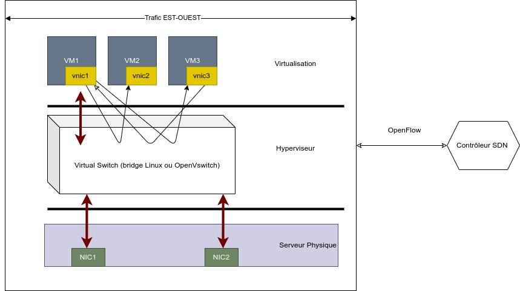
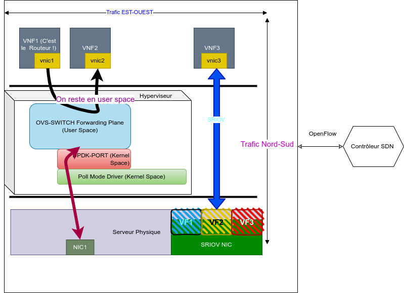
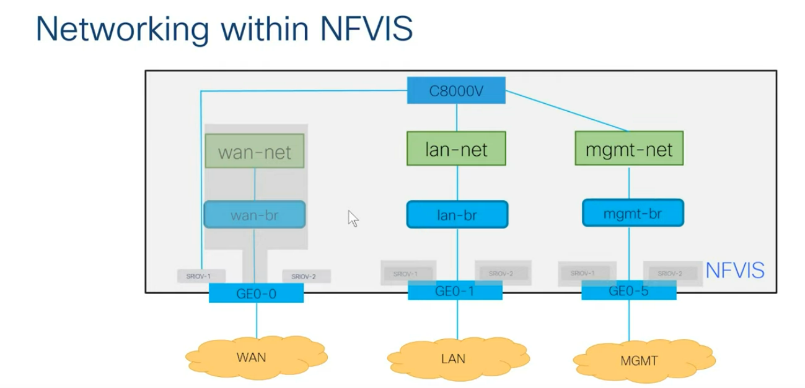
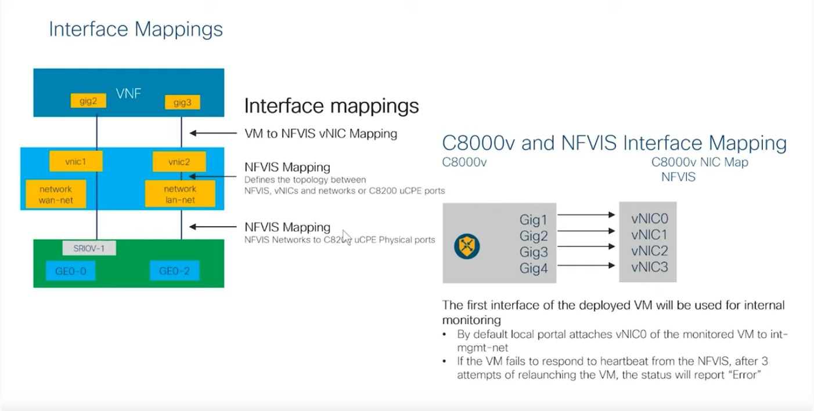
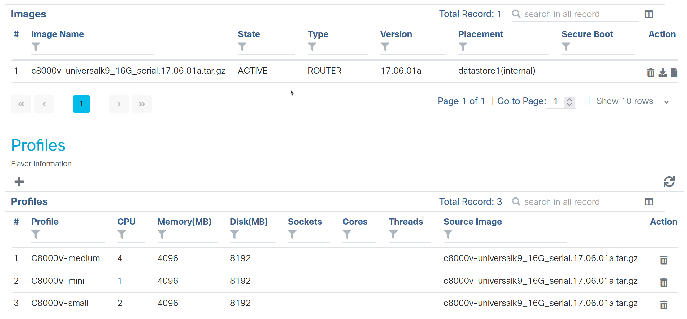
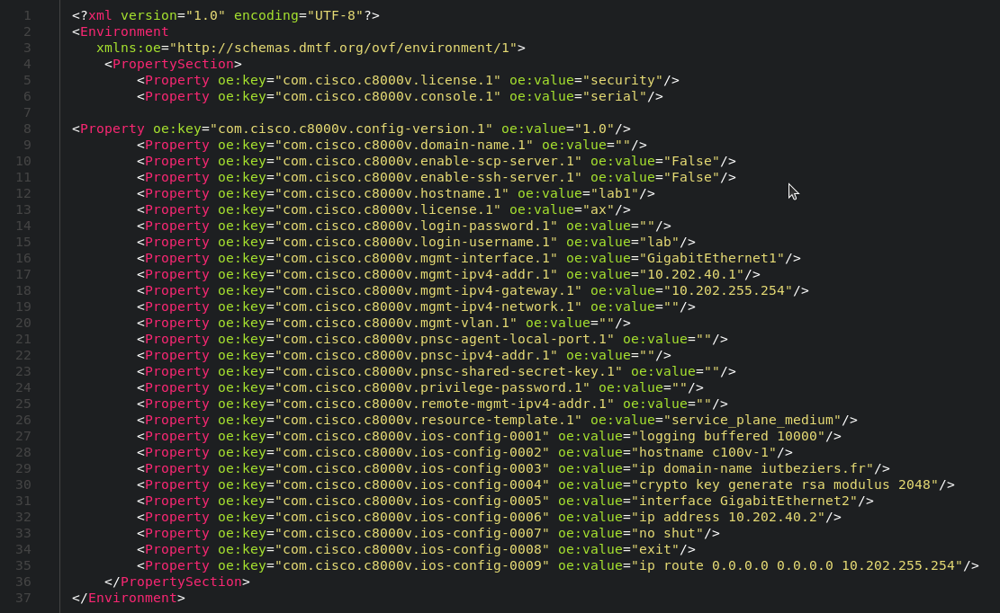
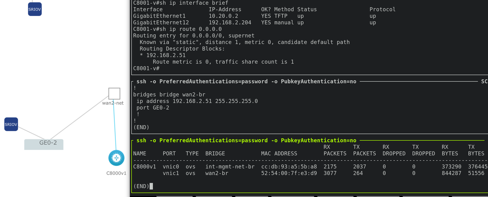
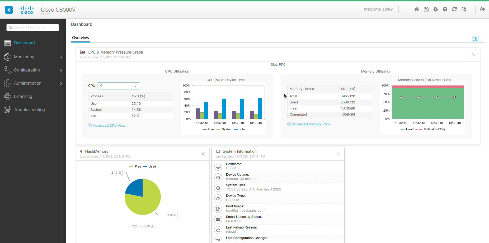

<!-- backgroundImage: url(images/blueteam1.png)-->

<h1> Présentation du Catalyst 8200 </h1>


---


<!-- backgroundImage: -->


### Network Functions Virtualization (NFV) 

- L'idée est de **virtualiser** des fonctions réseaux (Virtual Network Function = VNF ) des couches 4 à 7:  routeurs (comme un "route reflector" BGP) , pare-feux, équilibreurs de charges, antiddos...
- Comme pour la *virtualisation des systèmes* on s'appuie sur des hyperviseurs (VMWare, KVM) fonctionnant sur des serveurs "standards" ou des boîtiers dédiés comme le Catalyst 8200. 
   
---

<!-- backgroundImage: -->


### Les avantages du NVF

- la VNF est indépendante  du matériel sous jacent. Matériels qui peuvent être "on premises" ou dans le CLOUD et qui offrent du CPU et de la mémoire "en abondance".
- On peut chaîner les VNF ensemble afin d'obtenir un super service. 
- Les VNF sont liées au SDN (Software Defined Networking) qui peut optimiser les flux vers les VNF les plus appropriées.
- C'est une technologies en phase avec le CLOUD avec transformation des coûts fixes (CAPEX) en (OPEX), et le paiement des ressources consommées.


---
<!-- backgroundImage: -->


## NFVIS

Cisco a une infrastructure dédiée pour les  **VNF** qui s'appelle **NFVI** (**N**etwork **F**unction **V**irtualization **I**nfrastructure) et un **S**ystème qui permet de la mettre en oeuvre :  **NFVIS**.


---


<!-- backgroundImage: -->


### Catalyst 8200 définition "commerciale" par Cisco

<div style="text-align: left"> 

- Le système Cisco Catalyst 8200 Edge uCPE réunit des fonctions de _routage, de commutation, de stockage, de traitement_ et bien d'autres fonctions de calcul et de réseau dans une seule unité de rack compacte.
</div>

<div style="text-align: left"> 

- Le **Cisco Catalyst 8200** Edge uCPE prend en charge toutes ces fonctions en offrant une infrastructure pour le déploiement des fonctions de réseau virtualisées (NVF...), tout en agissant comme un serveur qui résout des problèmes de traitement, de workload et de stockage."
</div>

<div style="text-align: right"> 
source Cisco 
</div>

---

<!-- backgroundImage: -->


## Ma définition

C'est un **"<span style="color:red ">boitier de virtualisation"</span>** dont le système d'exploitation NFVIS est basé sur Linux et son hyperviseur KVM. Dans les dernières versions de NFVIS Docker et Kubernetes ont fait leur apparition.


Quand vous vous connectez via le port console, vous êtes sous NFVIS et non pas dans l'OS d'un routeur !
(user **admin** password par défaut **Admin123#** pou NFVIS) 

---

<!-- backgroundImage: -->


## De l'open source sous le capot du Catalyst

Le catalyst 8200 s'appuie sur:

- Un RedHat ( 7.2 à la date de la création de cette présentation)
- OpenVswitch
- KVM , LibVirt, virsh ...

---
## SRIOV et le catalyst 8200 

<!-- backgroundImage: -->


- Les cartes réseaux du catalyst 8200 supportent **SRVIOV** et permettent de connecter directement la VM à une carte réseau virtuelle émulée par la NIC physique.
  SRIOV est bien adapté au trafic **Nord-Sud** important ( VM vers Internet et vice versa)


---


### DPDK et le catalyst 8200 

<!-- backgroundImage: -->


  - Le catalyst 8200 support **DPDK**. 
  - DPDK permet de gérer les transferts du réseau en dehors de l'espace noyau (Kernel Space). Il ne copie donc pas les paquets de l'espace utilisateur vers l'espace noyau et on évite aussi les milliers d'interruptions faites par la carte réseau au CPU d'ou le gain en performance à très haut débit.
  - DPDK nécessite du développement logiciel puisque la pile TCP/IP n'est pas utilisée. Heureusement pour nous OpenVswitch a déjà fait ce travail et est capable d'utiliser DPDK. 
  - DPDK est bien adapté au trafic **Est-Ouest** (échanges entre VM), mais il consommera du CPU et de la mémoire.

---

#### Bridge ou OpenVswitch sans accélération

<!-- backgroundImage: -->




---

#### OpenVswitch et DPDK - SRIOV

<!-- backgroundImage: -->



---


<!-- backgroundImage: -->


###### Interface WEB de NFVIS.


---

<!-- backgroundImage: -->


# C8200


---
<!-- backgroundImage: -->


###### Le réseau et le C8200




---

<!-- backgroundImage: -->


## C8200

- On définit des réseaux (wan-net, lan-net,mgmt-net...).
- Les réseaux sont reliés à des **bridges** (wan-br, lan-br,mgmt-br..).
- Les bridges sont reliés aux "Virtual Functions"  **SRIOV**.
  (Les VM peuvent aussi se connecter directement aux cartes SRIOV).
- Les cartes réseaux physiques sont reliées aux différents LAN. 

---

<!-- backgroundImage: -->


#### C8200 NFVIS configuration au démarrage via le port Console


```ios
nfvis(config)# system settings mgmt ip address 10.202.100.1 255.255.0.0
nfvis(config)# system settings default-gw 10.202.255.254
nfvis(config)# system settings hostname c8200-1
nfvis(config)# end
```
ou utilisera le DHCP pour travailler dans n'importe quelle salle:

```ios
nfvis(config)# system settings dhcp
nfvis(config)# end
```

On peut aussi configurer  l'interface  "wan". Les adresses sont automatiquement reportées dans la configuration du bridge correspondant (mgmt-br wan-br)  et vice-versa. 

---

<!-- backgroundImage: -->


### Les bridges par défaut 

```ios
show running-config bridges

bridges bridge lan-br
ip address 192.168.88.10 255.255.255.0
port GE0-3

bridges bridge wan-br
 ip address 192.168.100.202 255.255.255.0
 port GE0-1
 !

bridges bridge lan-br
 dhcp
 port GE0-0
 !
!
bridges bridge cellular-br
 type cellular
 port int-CELL-1-0
 !
```

---

## Créer ses propres bridges 

<!-- backgroundImage: -->


```ios
c8200-jmp(config)# bridges bridge lan-br
c8200-jmp(config-bridge-lan-br)# ?
Possible completions:
  dhcp             IP Address negotiated via DHCP; Triggers 'dhcp-renew
  dhcp-ipv6        IPV6 Address negotiated via DHCP; Triggers 'dhcp-renew
  ip               IPV4 address configuration
  ipv6             IPV6 address configuration
  mac-aging-time   Maximum number of seconds to retain a MAC learning entry for which no packets have been seen
  port
  slaac-ipv6       IPV6 Address negotiated via stateless address configuration(slaac)
  type
  vlan             NFVIS management traffic VLAN tag on bridge
  ---
  commit           Commit current set of changes
  exit             Exit from current mode
  help             Provide help information
  no               Negate a command or set its defaults
  top              Exit to top level and optionally run command
```

---
<!-- backgroundImage: -->


# Oui mais je veux mon routeur!

- Don't worry ! Il est là sous forme d'une machine virtuelle. C'est le **"<span style="color:red "> C8000v </span>"**.
C'est une machine virtuelle qui se connecte au réseau via des bridges ou directement via **SRIOV** (la même technologie que les serveurs DELL que vous connaissez et qui améliore les performances). Le "boitier" est livré vide, il vous faudra "uploader" et installer l'image. 
- L'OS de ce routeur est "**IOS XE**". On y revient ensuite

---

<!-- backgroundImage: -->


#### Mapping d'interfaces

Chaque interface du 8200 est mappée sur une carte physique, une VF SRIOV, ou une "TAP" raccrochée à un bridge.



---


<!-- backgroundImage: -->


####  Import d'une image C8000v (qcow2, ova...) et de ses "saveurs" 



---
<!-- backgroundImage: -->


### Création d'un "bootstrap"  pour initialiser la VM

- On peut passer un fichier de bootstrap pour configurer la VM lors de sa création:
- On dispose de deux méthodes soit avec un fichier txt ou avec un fichier xml:
Voir:
https://www.cisco.com/c/en/us/td/docs/routers/C8000V/Configuration/c8000v-installation-configuration-guide/day0-bootstrap-configuration.html

---

<!-- backgroundImage: -->


###  Lister les images uploadées pour créer les VM

```ios
c8200-jmp# show system file-list disk local
...
107    Fedora-Cloud-Base-34-1.2.x86_64.qcow2     /data/intdatastore/uploads       250M   VM Package  
108    isrv-universalk9.17.03.03.qcow2           /data/intdatastore/uploads       1.5G   VM Package      
109    c8000v-universalk9_16G_serial.17.06.01a.  /data/intdatastore/uploads       1.5G   VM Package     
       tar.gz
110    nfvisvmpackagingtool.tar                  /data/intdatastore/uploads/vmpa  150K   VM Packaging   
```                                                 

---
<!-- backgroundImage: -->


### Exemple à partir d'une config txt et d'une ISO
```
hostname ultra-ios_cfg
license smart enable
username lab privilege 15 password lab
ip domain-name cisco.com
crypto key generate rsa modulus 1024
interface GigabitEthernet1
ip address 10.214.4.3 255.255.O.0
no shut
exit
ip route 0.0.0.0 0.0.0.0 10.214.255.254
line vty 0 4
login local
exit
```
```bash
mkisofs -l -o c8000v_config.iso . < iosxe.txt
```

---
<!-- backgroundImage: -->


### Exemple de fichier XML de bootstrap




---

<!-- backgroundImage: -->


## Creation de la VM à partir de l'image


---

<!-- backgroundImage: -->


# Connexions au routeur depuis ssh

- port forwarding
```ios
ssh -p 2122 admin@192.168.1.203
```

- direct

```
ssh admin@192.168.1.204
```

CTRL shift 5 pour sortir de la console KVM

---

<!-- backgroundImage: -->


#### Connexion du routeur C8000V directe de la VM au réseau physique via une "carte SRIOV" 


---

<!-- backgroundImage: -->


##### Connexion du routeur C8000V à un bridge connecté au réseau physique

Il faut:
- Un bridge avec une adresse IP dans le réseau de la VM.
- Sur la VM une interface avec une adresse IP dans le même réseau que le bridge ainsi qu'une route par défaut vers l'IP du bridge.
- Le trafic est routé vers internet par NFVIS via le bridge WAN.
  Existe-t-il une meilleure solution ?
  
---

<!-- backgroundImage: -->


##### Exemple de configuration pour une VM bridgée




---
<!-- backgroundImage: -->


#  Commandes utiles pour les réseaux

```ios
show system settings  [brief]
show system settings native
show running-config bridges
show bridges settings [nom_bridge]
show system networks
show system ports
shown pnic # voir l'état des cartes physiques
show pnic-detail
show vm_lifecycle vnic_stats
```

---

<!-- backgroundImage: -->


##  Commandes systèmes "mappées" sur  Linux

```ios
ssh admin@[ip-mgmt]
show log 
show log [fichiers] # Attention affichage long sur une console
support show arp
support show route
...

```

---

<!-- backgroundImage: -->


##  Commandes virsh "mappées" sur  Linux

```ios

c8200-jmp# support virsh list
 Id    Name                           State
----------------------------------------------------
 1     ROUTER1                        running
support virsh net-list
c8200-jmp# support virsh list
 Id    Name                           State
----------------------------------------------------
 1     ROUTER1                        running

c8200-jmp# support virsh dominfo ROUTER1
Id:             1
Name:           ROUTER1
UUID:           d07e7dfe-cba9-44aa-a4db-57881bd6a54a
OS Type:        hvm
State:          running
CPU(s):         2
CPU time:       3825.0s
Max memory:     4194304 KiB
..
```

---

<!-- backgroundImage: -->


###  Commandes OpenVswitch "mappées" sur  Linux

```ios

8200-jmp# support ovs vsctl list-br
cellular-br
int-mgmt-net-br
lan-br
wan-br
wan2-br
c8200-jmp#support ovs vsctl list interface wan-br
...
```

---


<!-- backgroundImage: -->


####  Gérer les images et la configuration de la VM

```ios
c8200-jmp# show vm_lifecycle opdata images
vm_lifecycle opdata images image c8000v-universalk9_16G_serial.17.06.01a.tar.gz
 image_id 450a12e2-cd41-4fc6-9567-a3608b48e324
 public   true
 state    IMAGE_ACTIVE_STATE
 property remove_src_on_completion
  value [ false ]
 property interface_hot_delete
  value [ true ]
 property bootstrap_file
```
 
---


<!-- backgroundImage: -->


###  Listez les VM 

```ios
c8200-jmp# show system deployments 
NAME     ID  STATE    TYPE
----------------------------
ROUTER1  1   running  vm
```

---

<!-- backgroundImage: -->


#### IOS XE web interface 


---
<!-- backgroundImage: -->
### Voir le rattachement de la VM au bridge


```ios
c8200-jmp# show vm_lifecycle deployments all

Name: C8000v1
Deployment Name : C8000v1
...

NICID  VNIC   NETWORK      IP        MAC-ADDRESS        MODEL    PORT-FORWARD
--------------------------------------------------------------------------------------
0      vnic0  int-mgmt-net 10.20.0.2 cc:db:93:a5:5b:a8  virtio   [ssh 2122 None]
1      vnic1  wan2-net     -         52:54:00:7f:e3:d9  virtio
```
---
<!-- backgroundImage: -->


## Accéder à la VM ROUTER1

```ios
c8200-jmp#  vmConsole ROUTER1
Connected to domain ROUTER1
Escape character is ^]

C8001>
```

---

<!-- backgroundImage: -->


# IOS-XE

Le routeur C8000v est un routeur dont le système d'exploitation est IOX-XE:

- IOS-XE repose sous Linux et à ce titre est capable de faire "tourner" plusieurs processus au contraire du très monolithique IOS.
- Néanmoins il est très proche de la syntaxe d'IOS afin de ne pas perdre les admin réseaux...
- Il s'appuie sur les CPU et la mémoire de l'hôte et est donc bien adapté au mode virtualisé et au CLOUD.  

---
<!-- backgroundImage: -->


Le 8000v est capable d'être piloté par un contrôleur SD-WAN mais par défaut il est en mode autonome.

```ios
Router#sh ver | include mode
Router operating mode: Autonomous
```

---


<!-- backgroundImage: -->


# Configurer l'accès SSH sur le routeur virtualisé C8000

```ios
Device# configure terminal
Device(config)# aaa new-model
Device(config)# aaa authentication login default local
Device(config)# aaa authorization exec default local
Device(config)# username cisco privilege 15 secret cisco
Device(config)# ip ssh time-out 120
Device(config)# ip ssh authentication-retries 3
Device(config)# ip scp server enable
```

---

<!-- backgroundImage: -->


#  Sur le routeur

```
Router#sh ip interface brief
Interface IP-Address OK? Method Status Protocol
GigabitEthernet1 10.20.0.2 YES TFTP up up
GigabitEthernet2 unassigned YES unset up up => GE-0
GigabitEthernet3 unassigned YES unset up up => GE-1
GigabitEthernet4 unassigned YES unset up up => GE-2
GigabitEthernet5 unassigned YES unset up
```
---

# Upgrade de NFVIS
<!-- backgroundImage: -->


```ios
show system upgrade reg-info
show system upgrade

UPGRADE UPGRADE
NAME STATUS FROM TO

Cisco\_NFVIS\_Upgrade-4.6.2-FC3.nfvispkg IN-PROGRESS - -
system upgrade reg-info name Cisco\_NFVIS\_Upgrade-4.6.2-FC3.nfvispkg
location /data/upgrade/register/Cisco\_NFVIS\_Upgrade-4.6.2-FC3.nfvispkg
package-version 4.6.2-FC3
status Valid
upload-date 2022-09-06T13:51:46.775051-00:00
```

